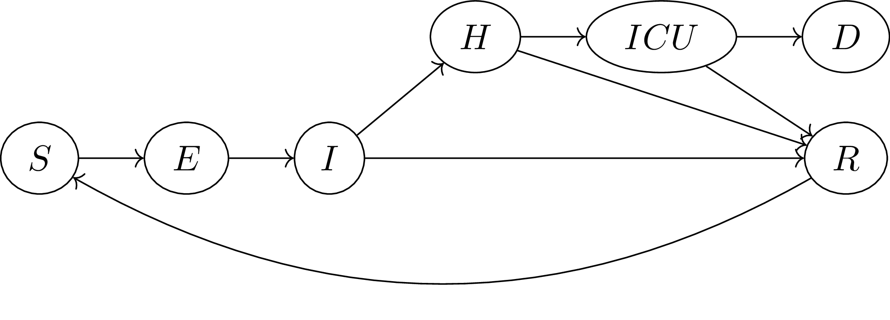

# covid_SEIHR_county

This repository contains a simple model used for forecasting cases, hospitalizations, ICU admissions, and deaths in California counties after the omicron wave.

# Data

* [Case](https://data.ca.gov/dataset/covid-19-time-series-metrics-by-county-and-state1), [hospitalization](https://data.ca.gov/dataset/covid-19-hospital-data1), [ICU admission](https://data.ca.gov/dataset/covid-19-hospital-data1), and [death](https://data.ca.gov/dataset/covid-19-time-series-metrics-by-county-and-state1) data come from the [California Open Data Portal](https://data.ca.gov).
* Delays for case reporting are estimated using line lists provided by the [Orange County Health Care Agency](https://www.ochealthinfo.com).

# Model

The model is a S-E-I-R-S type model with hospitalization and ICU compartments. It is defined in [bayes_seihricud.jl](src/bayes_seihricud.jl)
The model is fit with [fit_model.jl](scripts/fit_model.jl) using [Turing.jl](https://turing.ml/stable/).

Priors and posteriors for the model parameters are presented in [scalar_generated_quantities_plots.pdf](figures/scalar_generated_quantities_plots.pdf) and [vector_generated_quantities_plots.pdf](figures/vector_generated_quantities_plots.pdf).

# Results
Forecasts for each county are presented in [posterior_predictive_plots.pdf](figures/posterior_predictive_plots.pdf) and also available in [results_calcat_format.csv](results_calcat_format.csv), which are incorporated into the [California Communicable diseases Assessment Tool](https://calcat.covid19.ca.gov/cacovidmodels/).

